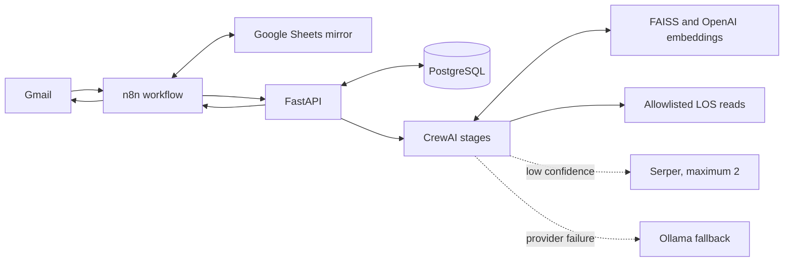

# NBFC LOS AI Email Ticketing System

Dockerized email-support application for a synthetic NBFC Loan Origination System (LOS). n8n receives Gmail messages and mirrors ticket state to Google Sheets; FastAPI owns ticket identity, PostgreSQL persistence, CrewAI reasoning, retrieval, validation, guardrails, and delivery idempotency.

All bundled customers, applications, and internal knowledge are synthetic demo data. The service is read-only: it must not approve loans, alter offers, update bank details, create mandates, or initiate disbursal.

> Status: implementation-complete for repository review, but not production-ready until provider credentials, deployed n8n/Gmail/Sheets execution, Docker startup, and SLA measurements are verified in the target environment.

## Architecture



The normal path is deterministic and sequential because later stages depend on verified earlier evidence:

```text
preflight and message reservation
  -> deterministic and semantic input guardrails
  -> RAG retrieval and conversation memory
  -> support research agent
  -> LOS data agent only for customer-specific questions
  -> independent validation agent
  -> Serper and revalidation below confidence 70, maximum 2
  -> manager only for unresolved evidence conflicts
  -> email agent
  -> semantic and deterministic output guardrails
  -> Gmail delivery confirmation
```

Different tickets can run concurrently. PostgreSQL serializes messages in the same Gmail thread to prevent duplicate or out-of-order replies.
An exact Gmail message retry remains a silent no-op. A new message in the same thread whose normalized body matches a previously delivered request receives one acknowledgement directing the customer to the earlier reply; a retry of that acknowledgement request is again a no-op. The n8n workflow records the acknowledgement as `ALREADY_ANSWERED` in the Sheet `outcome` column.

## Repository structure

```text
app/
  ai/                    CrewAI stages, typed contracts, fallback, pipeline
  memory/                Current-ticket history and closed-ticket summaries
  rag/                   FAISS, embeddings, source loading, ingestion CLI
  tools/                 Read-only LOS tools and bounded Serper search
  database.py            SQLAlchemy engine and transaction helpers
  db_models.py           PostgreSQL schema models
  postgres_repository.py Durable ticket/message/delivery repository
  repository.py          Repository factory and test-only memory repository
  seed_database.py       Transactional idempotent PostgreSQL seeding
  orchestrator.py        Deterministic agent state machine
  guardrails.py          Prompt-injection, secret, and PII checks
  spam.py                Spam history and reversible sender blocklist
  main.py                Authenticated FastAPI endpoints
migrations/              Alembic migration
data/seeds/              20 synthetic customers and 20 LOS applications
data/knowledge/          Synthetic documents and provenance manifest
data/faiss/              Generated persistent index mount
n8n/nbfc_email_ticketing.json  Workflow imported into deployed n8n
tests/                    API, DB, CrewAI, RAG, safety, and workflow tests
```

## Data design

PostgreSQL is authoritative; Google Sheets is an operational mirror.

- `customers` and `applications`: synthetic LOS records exposed only through allowlisted read tools.
- `ticket_identities`: UUID, sequence ticket number, Gmail thread, status, and parent link.
- `email_messages`: unique Gmail message ID, conversation, processing, and delivery state.
- `ticket_summaries`: PostgreSQL full-text-searchable closed-ticket memory.
- `spam_events` and `sender_blocklist`: high-confidence spam history and reversible blocking.
- `audit_events`: append-only operational and agent-stage audit schema.

The migration enforces one open ticket per thread, unique Gmail messages, foreign keys, valid states, a GIN memory index, and append-only audit events.

## API

All `/api/v1/*` routes require `X-Internal-API-Key`.

| Method | Path | Purpose |
|---|---|---|
| `GET` | `/health` | Container health |
| `POST` | `/api/v1/preflight` | Guardrails, spam, dedupe, ticket reservation |
| `POST` | `/api/v1/tickets/process` | Run the CrewAI pipeline |
| `POST` | `/api/v1/tickets/delivery` | Record Gmail `SENT` or `FAILED` idempotently |
| `POST` | `/api/v1/knowledge/ingest` | Rebuild the FAISS index |

Retryable OpenAI failures receive one retry, then one Ollama attempt. Low confidence gathers evidence instead of switching models. Failed validation or output safety returns a static safe fallback.

## Configuration

Copy `.env.example` to `.env`; never commit `.env`.

Required for full operation:

- `INTERNAL_API_KEY`: random string of at least 16 characters.
- `POSTGRES_PASSWORD`: database password; Compose constructs `DATABASE_URL` from the PostgreSQL settings.
- `OPENAI_API_KEY`: primary model and embeddings.
- `OLLAMA_BASE_URL`, `OLLAMA_API_KEY`, `OLLAMA_MODEL`: fallback model.
- `SERPER_API_KEY`: optional; without it web search is unavailable.

Controls include `ENABLE_CREWAI=true`, `CONFIDENCE_THRESHOLD=70`, `MAX_WEB_SEARCH_ATTEMPTS=2`, `PROCESSING_BUDGET_SECONDS=50`, `RAG_TOP_K=4`, `RAG_INDEX_PATH=data/faiss`, and the comma-separated `PUBLIC_SOURCE_ALLOWLIST`.

Set `ENABLE_CREWAI=false` only for isolated deterministic tests.

## Deploy

```bash
git clone <your-github-repository-url>
cd fintech-customer-ticketing-system
cp .env.example .env
nano .env
docker compose up -d --build
docker compose ps
curl http://127.0.0.1:8000/health
```

The API waits for PostgreSQL, applies Alembic migrations, and transactionally upserts the seeds before Uvicorn starts. PostgreSQL has no host port. Named volumes preserve PostgreSQL and FAISS data.

Verify database data:

```bash
docker compose logs --tail=100 api
docker compose exec api alembic current
docker compose exec db psql -U nbfc -d nbfc_ticketing -c "select count(*) from customers;"
docker compose exec db psql -U nbfc -d nbfc_ticketing -c "select count(*) from applications;"
```

Both expected counts are `20`. Seeding is idempotent.

## Knowledge ingestion

The repository contains source documents and their manifest. The FAISS index is generated on the server because embeddings depend on your OpenAI key and chosen model.

```bash
docker compose exec api python -m app.rag.build_index
```

Or use the protected endpoint:

```bash
curl -X POST http://127.0.0.1:8000/api/v1/knowledge/ingest \
  -H "X-Internal-API-Key: YOUR_INTERNAL_API_KEY" \
  -H "Content-Type: application/json" \
  -d '{"refresh_public":false}'
```

Local Markdown, text, and PDF are supported. Public HTTPS refresh is opt-in and enforces the configured host allowlist, content type, size limit, timeout, and no redirects. Every chunk retains source provenance; index metadata records the embedding model, dimension, and corpus checksum.

## n8n and Google Sheets

Import [`n8n/nbfc_email_ticketing.json`](n8n/nbfc_email_ticketing.json) into your deployed n8n instance. The repository stores this JSON; Compose does not import it automatically.

Keep the workflow inactive while you:

1. Replace `REPLACE_WITH_GOOGLE_SHEET_ID` and `https://REPLACE_WITH_FASTAPI_HOST`.
2. Assign Gmail OAuth2, Sheets OAuth2, and the FastAPI API-key credential.
3. Use a sheet tab named exactly `Tickets`.
4. Run one manual end-to-end email before activation.

The first sheet row must be:

```text
ticket_id,ticket_number,parent_ticket_id,gmail_thread_id,last_gmail_message_id,customer_email,subject,category,status,confidence,response_type,web_search_count,fallback_model_used,created_at,updated_at,last_response_at,closed_at,processing_time_ms,outcome,last_error
```

The committed Normalize Email code supports Gmail headers as an array or object, and preflight receives the Sheet lookup as `existing_ticket`. The export contains no real credential or sheet ID.

## Tests

```bash
docker build --target test -t nbfc-ticketing-tests .
docker run --rm nbfc-ticketing-tests
```

For PostgreSQL integration tests, start `db` and provide `TEST_DATABASE_URL` to the test container. Coverage includes migrations, seeds, lifecycle/idempotency, read-only LOS tools, CrewAI contracts, provider fallback, RAG provenance, Serper bounds and PII removal, guardrails, spam, and n8n shape.

## Operational limits

- Keep n8n inactive until API health, migrations, seed counts, FAISS ingestion, and one delivery callback pass.
- A Gmail trigger polling every minute cannot guarantee a strict 60-second receipt-to-send SLA; Gmail push delivery or a workflow-receipt SLA is required.
- Missing RAG, provider/search outage, insufficient evidence, or unsafe output fails closed and must not fabricate an answer.
- Public claims require approved public sources. Synthetic internal documents must never be described as a lender's real policy.
