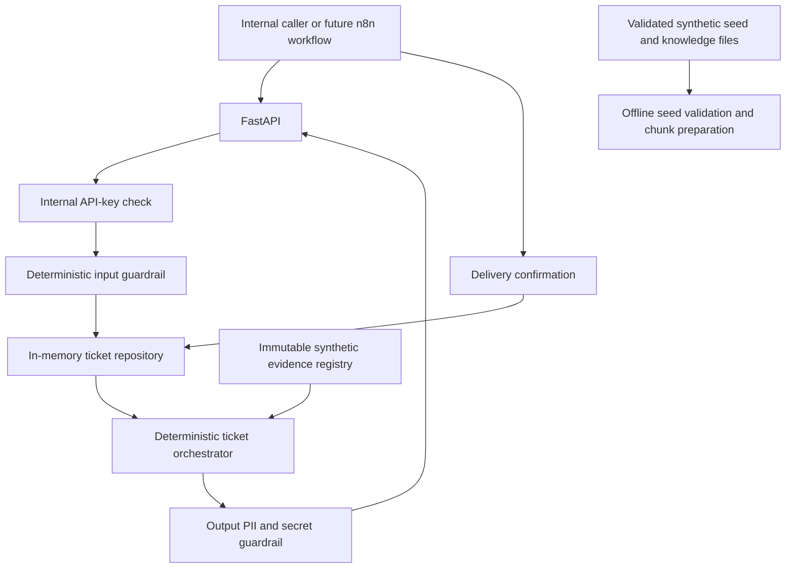
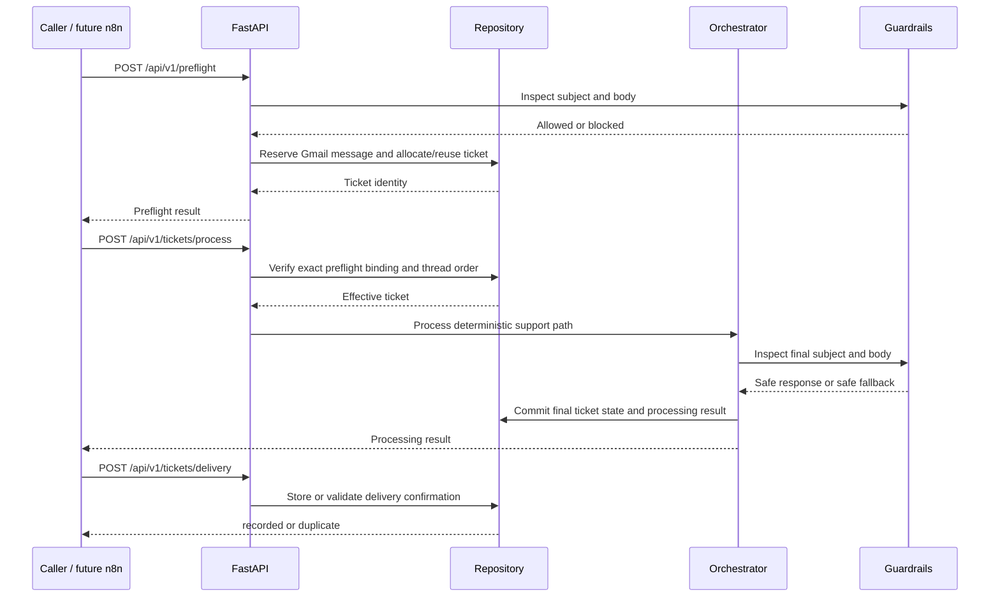
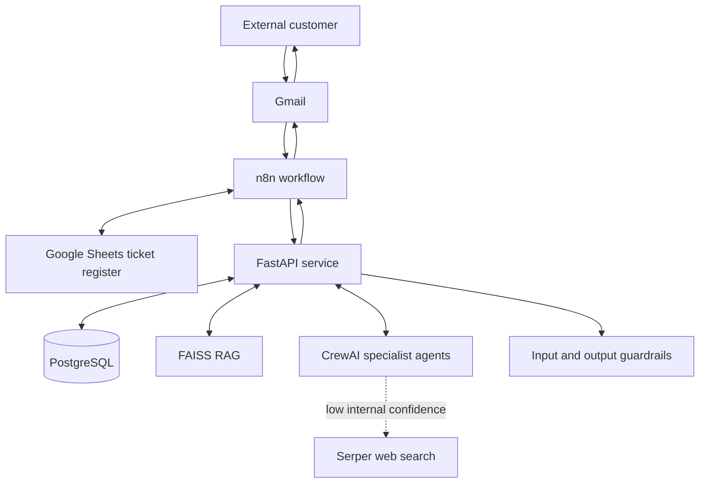

# NBFC LOS AI Email Ticketing System

Docker-first proof of concept for an AI-assisted customer email ticketing system supporting an NBFC Loan Origination System (LOS).

> **Status:** This repository currently contains a hardened deterministic API proof of concept. It is not the complete AI ticketing MVP and is not production-ready. The sections below distinguish current behavior from the target architecture described by the master build specification.

## Contents

- [Purpose](#purpose)
- [Implementation status](#implementation-status)
- [Current architecture](#current-architecture)
- [Request and ticket lifecycle](#request-and-ticket-lifecycle)
- [Repository structure](#repository-structure)
- [Component design](#component-design)
- [Data models](#data-models)
- [API reference](#api-reference)
- [Evidence and confidence](#evidence-and-confidence)
- [Security and guardrails](#security-and-guardrails)
- [Configuration](#configuration)
- [Running the application](#running-the-application)
- [Data ingestion and seed data](#data-ingestion-and-seed-data)
- [Deploying the n8n workflow](#deploying-the-n8n-workflow)
- [Running tests](#running-tests)
- [Operational behavior](#operational-behavior)
- [Known limitations](#known-limitations)
- [Target architecture and roadmap](#target-architecture-and-roadmap)
- [Troubleshooting](#troubleshooting)

## Purpose

The intended product receives customer emails about a loan-origination journey, identifies the request type, retrieves supporting evidence, optionally checks customer-specific LOS state, validates the response, and returns a safe reply for delivery by Gmail through n8n.

The supported LOS journey is expected to cover:

```text
PAN
  -> Bureau
  -> Underwriting
  -> Initial Offer
  -> Bank Statement
  -> Final Offer or Continue with Initial Offer
  -> Bank Account
  -> Mandate Setup
  -> Dashboard
  -> Loan Origination / Disbursal
```

The application is support/read-only. It must never approve loans, modify offers, change bank information, initiate mandates, disburse funds, or otherwise mutate LOS state.

## Implementation status

### Implemented now

| Capability | Current implementation |
|---|---|
| HTTP API | FastAPI with health, preflight, processing, and delivery endpoints |
| Internal authentication | Required `X-Internal-API-Key`, minimum 16 characters, constant-time comparison |
| Ticket identity | UUID plus sequential display number such as `TKT-000001` |
| Gmail idempotency | A Gmail message must pass preflight once; completed processing retries return `NO_ACTION` |
| Thread lifecycle | Open-thread reuse, closed-thread child ticket creation, parent linkage |
| Message ordering | Messages are processed in preflight order across the entire Gmail thread |
| Concurrent processing | A second message for a busy thread receives HTTP `409` |
| Input guardrail | Deterministic prompt-injection phrase detection over subject and body |
| Output guardrail | PAN/mobile/account masking and blocking of detected credentials/internal instructions |
| Resolution handling | Conservative explicit-resolution detection with negation and renewed-failure checks |
| Evidence | Immutable registry containing one synthetic bank-statement guidance record |
| Knowledge source data | Three clearly labelled synthetic Markdown documents plus a provenance manifest |
| Ingestion preparation | Validated, traversal-safe Markdown loading and deterministic overlapping JSON chunk generation |
| Demo seed data | 20 synthetic customers linked to 20 LOS applications with full journey-state coverage |
| n8n workflow artifact | Inactive, importable workflow JSON with Gmail, Sheets, API, safety, closure, and delivery branches |
| Confidence | Deterministic registry-backed validation for the one supported demo answer |
| Delivery confirmation | Complete delivery payload retained in memory; exact repeats are idempotent and conflicts are rejected |
| Packaging | Multi-stage Docker image with a non-root production user |
| Tests | Unit/API regression coverage, including adversarial lifecycle and guardrail cases |

### Not implemented yet

| Target capability | Status |
|---|---|
| PostgreSQL persistence and migrations | Not implemented |
| PostgreSQL loading of synthetic customer/application data | JSON seed bundle and validation are implemented; database loading is not |
| CrewAI agents and tasks | Not implemented |
| OpenAI primary model | Not implemented |
| Ollama fallback model | Not implemented |
| FAISS knowledge retrieval | Not implemented |
| Public source retrieval, PDF parsing, embeddings, and FAISS loading | Not implemented; local Markdown validation/chunking is available |
| Serper web search and bounded retries | Not implemented |
| LLM-assisted semantic guardrails | Not implemented |
| Spam history and reversible sender blocklist | Not implemented |
| Ticket conversation memory and summaries | Not implemented |
| Append-only audit events and structured logging | Not implemented |
| Live n8n/Gmail/Google Sheets integration | Workflow JSON is included; deployment credentials, import, activation, and end-to-end execution are not verified |
| SLA instrumentation and end-to-end latency measurements | Not implemented |

## Current architecture



All state currently lives inside one Python process. Restarting the container deletes ticket, message, processing, and delivery state.

## Request and ticket lifecycle

### Normal request flow



### Ticket states

```text
NEW -> PROCESSING -> WAITING_FOR_CUSTOMER -> CLOSED
```

- General answers, information requests, and safe fallbacks leave the ticket `WAITING_FOR_CUSTOMER`.
- Only an explicit customer resolution confirmation can close a ticket.
- Ambiguous gratitude such as “Thanks for the update” does not close it.
- An unsafe generated resolution response becomes `SAFE_FALLBACK`; the ticket remains `WAITING_FOR_CUSTOMER`.

### Gmail thread rules

- One open Gmail thread maps to one open ticket.
- New messages reuse the open ticket.
- A message received after the prior ticket closes creates a new child ticket.
- If a message was queued before closure, processing re-evaluates the lifecycle and atomically moves pending messages to the correct child ticket.
- The processing response can therefore contain a different `ticket_id` and `ticket_number` from the original preflight result. Callers must use the processing response as the authoritative identity.

### Idempotency and ordering

- `gmail_message_id` is the message idempotency key.
- A duplicate preflight request returns `duplicate: true` and no ticket payload.
- A repeated process request for a completed message returns:

```json
{
  "action": "NO_ACTION",
  "duplicate": true,
  "safe_to_send": false
}
```

- A later message cannot process before an earlier message in the same Gmail thread.
- A concurrent or out-of-order request receives HTTP `409`.

## Repository structure

```text
fintech-customer-ticketing-system/
|
|-- app/
|   |-- __init__.py          Package marker
|   |-- config.py            Environment loading and startup validation
|   |-- guardrails.py        Input detection, PII masking, output inspection
|   |-- ingestion.py         Knowledge manifest validation and Markdown chunking
|   |-- knowledge.py         Immutable synthetic evidence registry
|   |-- main.py              FastAPI application and HTTP routes
|   |-- models.py            Pydantic request, response, ticket, and state models
|   |-- orchestrator.py      Deterministic routing, confidence, lifecycle commits
|   |-- repository.py        In-memory identity, ordering, idempotency, delivery state
|   `-- seed_data.py         Synthetic seed validation and state-coverage report
|
|-- data/
|   |-- knowledge/
|   |   |-- public/          Staging rules for approved public sources
|   |   |-- synthetic/       Demo LOS states, failure codes, and playbooks
|   |   `-- manifest.json    Allowlisted document metadata and provenance
|   |-- seeds/
|   |   |-- applications.json 20 linked synthetic LOS applications
|   |   `-- customers.json   20 synthetic example.com customers
|   |-- derived/             Ignored generated ingestion output
|   `-- README.md            Data contracts and operating instructions
|
|-- n8n/
|   `-- nbfc_email_ticketing.json  Workflow to import into the deployed n8n instance
|
|-- tests/
|   |-- conftest.py          Test environment configuration
|   |-- test_api.py          API, lifecycle, delivery, and security regressions
|   |-- test_config.py       Environment validation
|   |-- test_guardrails.py   PII, injection, credential, and query sanitization
|   |-- test_ingestion.py    Manifest, chunking, provenance, and path-safety tests
|   |-- test_orchestrator.py Resolution and evidence validation
|   |-- test_repository.py   Ticket identity, thread reuse, and ordering
|   `-- test_seed_data.py    Seed linkage and LOS state-coverage tests
|
|-- .dockerignore
|-- .env.example
|-- .gitignore
|-- Dockerfile               Base, test, and non-root runtime stages
|-- docker-compose.yml       Local API service and health check
|-- requirements.txt         Fully pinned runtime dependencies
|-- requirements-dev.txt     Pinned test dependencies
`-- README.md
```

## Component design

### `app/main.py`

Owns the HTTP boundary:

- creates the FastAPI application;
- authenticates non-health endpoints;
- validates input through Pydantic;
- invokes preflight, processing, and delivery services;
- maps repository conflicts to HTTP `404`, `409`, or `422` responses.

### `app/repository.py`

Owns current process-local state:

- ticket UUID and sequential number allocation;
- Gmail-thread to ticket mapping;
- exact preflight payload reservations;
- per-thread message order;
- processing-in-progress markers;
- cached processing results;
- queued-message remapping after closure;
- complete delivery confirmations.

The `RLock` protects repository mutations within one process. It does not coordinate multiple containers or multiple Uvicorn workers.

### `app/orchestrator.py`

Owns deterministic application behavior:

- resolution classification;
- supported bank-statement intent routing;
- missing-information and safe-fallback responses;
- registered evidence validation and confidence scoring;
- subject/body output inspection;
- final state commits only after the response is known to be safe.

It does not currently invoke an LLM, CrewAI, a database, FAISS, or web search.

### `app/guardrails.py`

Implements deterministic safeguards:

- Unicode normalization before prompt-injection checks;
- detection of common instruction-override and secret-extraction phrases;
- PAN masking to `******1234F`;
- mobile masking to `******4321`;
- numeric bank-account masking while retaining four trailing digits;
- blocking of common API-key, password, bearer-token, authorization, and internal-instruction formats;
- sanitization for future web-search queries.

Regex guardrails reduce known risks but cannot provide semantic security guarantees. The target implementation also requires LLM-assisted inspection.

### `app/knowledge.py`

Contains typed, immutable synthetic evidence. The current registry has one bank-statement record containing:

- evidence ID;
- `SYNTHETIC_INTERNAL` provenance;
- source title and content;
- supported question terms;
- the exact approved customer-facing demo answer.

Synthetic evidence must never be represented as a real lender’s unpublished policy.

### `app/ingestion.py`

Owns the offline knowledge-data boundary:

- validates the allowlisted document manifest and unique document IDs;
- requires a source URL for every `PUBLIC_NBFC` document;
- prevents manifest paths from escaping the configured data root;
- reads UTF-8 Markdown and creates deterministic overlapping chunks;
- preserves document ID, source type, title, URL, timestamp, and chunk ID;
- optionally writes JSON for a later embeddings/indexing stage.

It does not fetch URLs, parse PDFs, call an embedding model, or write to FAISS.

### `app/seed_data.py`

Validates the demo customer and LOS application seed bundle. It enforces synthetic identifiers and classification, `example.com` email addresses, unique identities, valid application-to-customer references, ISO timestamps, demo-only failure codes, and representative coverage of every supported journey-state value.

It does not insert records into PostgreSQL because this proof of concept has no database schema or migration layer yet.

## Data models

### Incoming email

| Field | Type | Required | Purpose |
|---|---|---:|---|
| `gmail_message_id` | string | Yes | Message idempotency key |
| `gmail_thread_id` | string | Yes | Conversation/thread identity |
| `sender_email` | string | Yes | Customer lookup key for future LOS integration |
| `subject` | string | No | Email subject; defaults to empty |
| `body_text` | string | Yes | Plain-text email body |
| `received_at` | ISO-8601 datetime | No | Defaults to current UTC time |

### Ticket

| Field | Type | Purpose |
|---|---|---|
| `ticket_id` | UUID | Immutable internal identity |
| `ticket_number` | string | Customer-readable sequential number |
| `gmail_thread_id` | string | Associated Gmail thread |
| `parent_ticket_id` | UUID or null | Previous closed ticket when a child is created |
| `status` | enum | `NEW`, `PROCESSING`, `WAITING_FOR_CUSTOMER`, or `CLOSED` |
| `created_at` | datetime | UTC creation time |

### Processing result

| Field | Purpose |
|---|---|
| `ticket_id`, `ticket_number` | Authoritative ticket identity after lifecycle re-evaluation |
| `action` | `SEND_REPLY`, `CLOSE_TICKET`, `SAFE_FALLBACK`, or `NO_ACTION` |
| `response_type` | `ANSWER`, `NEED_MORE_INFO`, or `SAFE_FALLBACK` |
| `subject`, `body` | Guarded response content |
| `confidence` | Deterministic evidence-quality score from 0 to 100 |
| `safe_to_send` | Whether the guarded response is eligible for sending |
| `duplicate` | Whether processing was already completed |
| `evidence_ids` | Evidence records supporting the response |
| `validation_decision` | `PASS`, `NEED_MORE_INFORMATION`, or `SAFE_FALLBACK` |
| `web_search_count` | Always zero in the current implementation |
| `manager_used` | Always false in the current implementation |
| `fallback_model_used` | Always false in the current implementation |
| `processing_time_ms` | In-process processing duration |

## API reference

Interactive documentation is available at:

- Swagger UI: `http://localhost:8000/docs`
- ReDoc: `http://localhost:8000/redoc`
- OpenAPI JSON: `http://localhost:8000/openapi.json`

All `/api/v1/*` endpoints require:

```http
X-Internal-API-Key: <configured-secret>
```

### `GET /health`

Authentication: not required.

Response:

```json
{
  "status": "ok"
}
```

This is a process-health check only. No external dependencies currently exist.

### `POST /api/v1/preflight`

Runs the input guardrail, rejects duplicate messages, and allocates or reuses a ticket.

Request:

```json
{
  "gmail_message_id": "msg-001",
  "gmail_thread_id": "thread-001",
  "sender_email": "demo@example.com",
  "subject": "Bank statement",
  "body_text": "Why is a bank statement required?",
  "received_at": "2026-08-19T10:00:00Z"
}
```

Allowed response:

```json
{
  "allowed": true,
  "duplicate": false,
  "blocked": false,
  "ticket": {
    "ticket_id": "7a58eebf-a2f2-4a80-8b2c-8fca7d25fdc6",
    "ticket_number": "TKT-000001",
    "gmail_thread_id": "thread-001",
    "parent_ticket_id": null,
    "status": "NEW",
    "created_at": "2026-08-19T10:00:01Z",
    "is_new": true
  },
  "guardrail": {
    "spam": false,
    "prompt_injection": false,
    "reason_codes": []
  }
}
```

Blocked prompt-injection response has `allowed: false`, `blocked: true`, and `ticket: null`. Duplicate response has `duplicate: true` and `ticket: null`.

### `POST /api/v1/tickets/process`

Requires the exact subject, body, sender, Gmail message ID, and Gmail thread ID accepted by preflight, plus the returned ticket identity.

Request:

```json
{
  "ticket_id": "7a58eebf-a2f2-4a80-8b2c-8fca7d25fdc6",
  "ticket_number": "TKT-000001",
  "gmail_message_id": "msg-001",
  "gmail_thread_id": "thread-001",
  "sender_email": "demo@example.com",
  "subject": "Bank statement",
  "body_text": "Why is a bank statement required?",
  "received_at": "2026-08-19T10:00:00Z"
}
```

Supported demo answer response:

```json
{
  "ticket_id": "7a58eebf-a2f2-4a80-8b2c-8fca7d25fdc6",
  "ticket_number": "TKT-000001",
  "action": "SEND_REPLY",
  "response_type": "ANSWER",
  "subject": "Re: Bank statement",
  "body": "In this demo workflow, a bank statement is used to review income and cash-flow information during loan assessment. Actual lender requirements may differ; please follow the instructions shown in your application.",
  "confidence": 90,
  "safe_to_send": true,
  "duplicate": false,
  "evidence_ids": ["SYNTHETIC-INTERNAL-BANK-STATEMENT-001"],
  "validation_decision": "PASS",
  "web_search_count": 0,
  "manager_used": false,
  "fallback_model_used": false,
  "processing_time_ms": 1
}
```

Important behaviors:

- Unknown questions return `SAFE_FALLBACK` below the confidence threshold.
- Pending/application-status questions request more information.
- Explicit resolution confirmation returns `CLOSE_TICKET` only if final output is safe.
- A processing retry returns `NO_ACTION` and `safe_to_send: false`.
- Payload mismatch, unregistered message, out-of-order message, or active thread processing returns HTTP `409`.
- Unknown ticket identity returns HTTP `404`.

### `POST /api/v1/tickets/delivery`

Records whether a response was sent after processing completed.

Successful delivery request:

```json
{
  "ticket_id": "7a58eebf-a2f2-4a80-8b2c-8fca7d25fdc6",
  "gmail_inbound_message_id": "msg-001",
  "delivery_status": "SENT",
  "gmail_outbound_message_id": "out-001",
  "sent_at": "2026-08-19T10:00:05Z"
}
```

Failed delivery request:

```json
{
  "ticket_id": "7a58eebf-a2f2-4a80-8b2c-8fca7d25fdc6",
  "gmail_inbound_message_id": "msg-001",
  "delivery_status": "FAILED",
  "error_code": "GMAIL_SEND_FAILED"
}
```

Responses:

```json
{"status": "recorded"}
```

or, for an exact repeat:

```json
{"status": "duplicate"}
```

Rules:

- `SENT` requires `gmail_outbound_message_id`.
- Delivery cannot be recorded before processing completes.
- The inbound message must belong to the supplied ticket.
- Exact repeats are accepted idempotently.
- A previous `FAILED` record may transition to `SENT` after a successful retry.
- Conflicting successful outbound IDs return HTTP `409`.

## Evidence and confidence

The configured confidence threshold defaults to `70`.

Current scoring uses this deterministic rubric:

| Dimension | Points |
|---|---:|
| Evidence relevance | 30 |
| Answer groundedness | 30 |
| Question coverage | 20 |
| Source consistency | 10 |
| Ambiguity | 0 for synthetic-only evidence, otherwise 10 |

The current validator returns zero unless:

- all evidence objects exactly match immutable registry entries;
- the question contains a term supported by the evidence;
- the response exactly matches the evidence’s approved customer answer;
- the answer is marked complete.

The supported synthetic bank-statement answer scores `90`. This score is an evidence-quality gate, not a statistical probability.

## Security and guardrails

### Authentication

- Every non-health route requires the internal API key.
- The service refuses to start when the key is missing or shorter than 16 characters.
- The key comparison uses `secrets.compare_digest`.
- Do not reuse the example or test keys in a shared environment.

### Input boundary

- Subject and body are always treated as untrusted customer data.
- Unicode is normalized before deterministic injection checks.
- Detected injection requests are blocked before ticket creation.

### Output boundary

- Subject and body are both inspected.
- Recognized PII is masked before returning a response.
- Credential and internal-instruction violations cause regeneration to a fixed safe fallback.
- Ticket closure occurs only after this final guardrail result is known.

### Container boundary

- The runtime image executes as the non-root `app` user.
- The production stage excludes pytest and HTTP test dependencies.
- Runtime dependency versions are fully pinned.

### Current security limitations

- Regex detection cannot identify every prompt injection, obfuscation, secret format, or contextual privacy violation.
- There is no rate limiting or request-size limit.
- State and locks are not shared across processes or containers.
- There is no durable audit log.
- The service should remain internal-only until the planned security and persistence layers are implemented.

## Configuration

Copy `.env.example` to `.env` and replace placeholder values.

| Variable | Required now | Default | Current use |
|---|---:|---|---|
| `INTERNAL_API_KEY` | Yes | None | Authenticates `/api/v1/*`; minimum 16 characters |
| `CONFIDENCE_THRESHOLD` | No | `70` | Evidence gate; validated from 1 to 100 |
| `MAX_WEB_SEARCH_ATTEMPTS` | No | `2` | Validated from 0 to 2; reserved because search is not implemented |
| `OPENAI_API_KEY` | No | Empty | Reserved for target implementation |
| `OPENAI_MODEL` | No | `gpt-4o-mini` | Reserved for target implementation |
| `OPENAI_EMBEDDING_MODEL` | No | `text-embedding-3-small` | Reserved for target implementation |
| `OLLAMA_BASE_URL` | No | Empty | Reserved for target implementation |
| `OLLAMA_API_KEY` | No | Empty | Reserved for target implementation |
| `OLLAMA_MODEL` | No | `glm-5.2:cloud` | Reserved for target implementation |
| `SERPER_API_KEY` | No | Empty | Reserved for target implementation |
| `DATABASE_URL` | No | Empty | Reserved for PostgreSQL implementation |
| `DATA_ROOT` | No | `data` | Root containing `knowledge/` and `seeds/` |
| `RAG_CHUNK_SIZE` | No | `800` | Character target for offline Markdown chunks |
| `RAG_CHUNK_OVERLAP` | No | `150` | Adjacent chunk overlap; must be smaller than chunk size |

Never commit `.env`; it is excluded by `.gitignore` and `.dockerignore`.

## Running the application

### Prerequisites

- Docker Desktop or Docker Engine with Compose support
- Port `8000` available locally

### Linux/macOS/Git Bash

```bash
cp .env.example .env
# Edit .env and replace INTERNAL_API_KEY.
docker compose up --build
```

### PowerShell

```powershell
Copy-Item .env.example .env
# Edit .env and replace INTERNAL_API_KEY.
docker compose up --build
```

Verify:

```bash
curl http://localhost:8000/health
```

Expected:

```json
{"status":"ok"}
```

Stop the service:

```bash
docker compose down
```

## Data ingestion and seed data

All bundled records are synthetic demo data. They contain no real customer data and must not be presented as an NBFC's actual policy or customer state. The application runtime does not automatically import these files.

### Validate the seed bundle

The validator loads both JSON files, checks contracts and relationships, and prints observed LOS state coverage:

```powershell
docker run --rm --entrypoint python nbfc-ticketing-tests -m app.seed_data
```

Expected top-level counts are `20` customers and `20` applications. The applications include pending, successful, failed, approved, rejected, available, accepted, declined, and not-started examples where those values are valid for each stage. Failure codes use the `DEMO_` prefix.

This validates database-ready fixtures; it does not insert into a database. The eventual PostgreSQL seeder must be added with the schema and migrations so writes can be transactional and repeatable.

### Validate and chunk the knowledge corpus

```powershell
docker run --rm --entrypoint python nbfc-ticketing-tests -m app.ingestion
```

To generate a derived JSON file from an environment with the Python dependencies installed:

```powershell
python -m app.ingestion --output data/derived/knowledge_chunks.json
```

`data/derived/*` is ignored because it is reproducible. The three manifest entries are synthetic Markdown documents. `data/knowledge/public/` is only a staging area: adding a public source requires an approved local document, a `PUBLIC_NBFC` manifest entry, and its canonical URL. External retrieval, PDF extraction, embeddings, and FAISS persistence remain future work.

## Deploying the n8n workflow

The repository stores the inactive workflow export at [`n8n/nbfc_email_ticketing.json`](n8n/nbfc_email_ticketing.json). n8n itself is not deployed by this repository. Import this file into the existing deployed n8n instance; do not copy it into the FastAPI container.

The workflow contains the complete node graph and deliberately contains no working credentials or secrets. It will not run until the deployment-specific placeholders and credentials are configured.

### 1. Prepare the Google Sheet

Create a tab named `Tickets` with this exact header row:

```text
ticket_id,ticket_number,parent_ticket_id,gmail_thread_id,last_gmail_message_id,customer_email,subject,category,status,confidence,response_type,web_search_count,fallback_model_used,created_at,updated_at,last_response_at,closed_at,processing_time_ms,outcome,last_error
```

Google Sheets is the operational register only. FastAPI remains authoritative for ticket identity, duplicate detection, ordering, and lifecycle decisions.

### 2. Import into the deployed instance

In the deployed n8n editor:

1. Select **Import from File** and choose `n8n/nbfc_email_ticketing.json` from this repository.
2. Keep the workflow inactive while configuring it.
3. Replace every `REPLACE_WITH_GOOGLE_SHEET_ID` value with the deployed Sheet ID.
4. Change `Tickets` on every Google Sheets node if a different tab name is required.
5. Replace every `https://REPLACE_WITH_FASTAPI_HOST` URL with the FastAPI base URL reachable from the n8n host. Do not use `localhost` unless both processes actually share the same network namespace.

### 3. Assign credentials in n8n

Create and assign these credentials using the n8n credential store:

| Credential | Assign to | Required configuration |
|---|---|---|
| `NBFC Gmail OAuth2` | `Gmail Trigger`, `Gmail Reply` | The support mailbox OAuth account and required Gmail scopes |
| `NBFC Google Sheets OAuth2` | Every Google Sheets node | Access to the configured ticket-register Sheet |
| `NBFC FastAPI X-Internal-API-Key` | Every HTTP Request node | Header name `X-Internal-API-Key`; value must match the FastAPI `INTERNAL_API_KEY` |

Never paste credential values into the workflow JSON. The names in the export are placeholders; select the actual credentials after import.

### 4. Test before activation

1. Confirm the n8n host can reach `GET <FastAPI base URL>/health`.
2. Run the workflow manually with a dedicated test email.
3. Verify the Sheet moves through `PROCESSING` and then `WAITING_FOR_CUSTOMER`, `CLOSED`, or a recorded failure outcome.
4. Verify blocked and duplicate messages do not reach `Gmail Reply`.
5. Verify unsafe responses do not reach `Gmail Reply`.
6. Verify both successful and failed Gmail attempts call the delivery-confirmation endpoint.
7. Activate the Gmail trigger only after those checks pass.

The JSON has passed both repository validation and an isolated import using the official `n8nio/n8n:latest` container. Import, credential mapping, and execution against the actual deployed n8n instance remain deployment checks because this workspace has no access to that instance or its credentials.

## Running tests

Tests are isolated from the production image through the Docker `test` stage.

```bash
docker build --target test -t nbfc-ticketing-tests .
docker run --rm \
  -e INTERNAL_API_KEY=test-internal-key-12345 \
  nbfc-ticketing-tests
```

PowerShell equivalent:

```powershell
docker build --target test -t nbfc-ticketing-tests .
docker run --rm -e INTERNAL_API_KEY=test-internal-key-12345 nbfc-ticketing-tests
```

The suite covers:

- authentication and configuration bounds;
- preflight message binding and duplicate rejection;
- open-thread reuse and closed-thread child creation;
- concurrent and out-of-order message rejection;
- queued-message remapping after closure;
- processing retry idempotency;
- delivery binding, exact repeats, and conflicting outbound IDs;
- explicit and ambiguous resolution phrases;
- PAN, mobile, and bank-account masking;
- prompt-injection and credential-format regressions;
- web-query PII/secret sanitization;
- registered and fabricated evidence behavior;
- knowledge provenance, path containment, and chunk boundaries;
- seed uniqueness, linkage, timestamps, and LOS state coverage;
- n8n JSON shape, inactive-by-default state, required nodes, API paths, and absence of embedded secrets;
- safe fallback state consistency.

## Operational behavior

### Health checks

Compose calls `/health` every five seconds with a three-second timeout and five retries.

### Failure behavior

- Invalid API key: HTTP `401`.
- Invalid Pydantic payload: HTTP `422`.
- Unknown ticket: HTTP `404`.
- Message binding, ordering, processing, or delivery conflict: HTTP `409`.
- Insufficient evidence: safe fallback; no fabricated answer.
- Unsafe output: fixed safe fallback; ticket does not close.

### Scaling constraints

The in-memory repository and lock are safe only within one Python process. Do not run multiple Uvicorn workers or multiple replicas and expect correct identity, idempotency, ordering, or delivery behavior. PostgreSQL-backed atomic constraints and advisory locking are required before scaling horizontally.

## Known limitations

- All state disappears on restart.
- Only one factual support intent has a registered demo answer.
- Customer-specific LOS lookup does not exist; bundled JSON is not loaded into the runtime repository.
- Knowledge chunks are prepared offline but are not embedded or queried by the runtime orchestrator.
- Email history and ticket memory are not stored.
- No external email is received or sent by this repository.
- The n8n workflow must still be imported, configured, tested, and activated on the deployed n8n instance.
- Prompt-injection and output checks are deterministic rather than semantic.
- No spam counting, sender blocklist, audit log, metrics, tracing, or SLA timer exists.
- `sender_email` receives only minimal string-length validation in the current Pydantic model.
- The 60-second end-to-end target has not been measured.
- The current code is suitable for local demonstration and incremental development, not production customer traffic.

## Target architecture and roadmap

The target system keeps external workflow integration in n8n and application reasoning in Python:



### Target responsibility boundaries

#### n8n

The future n8n workflow should own external integration only:

- receive Gmail events and normalize the payload;
- look up the Gmail thread in Google Sheets;
- call FastAPI preflight and processing endpoints;
- create or update the operational ticket row;
- send a Gmail reply only when the response action permits it and `safe_to_send` is true;
- report the final Gmail result to the delivery endpoint;
- handle workflow-level integration failures.

Agent reasoning, RAG, confidence decisions, and customer-state interpretation belong in Python rather than n8n.

#### Python/FastAPI

The target Python service should own:

- authentication and input validation;
- ticket identity, deduplication, and thread ordering;
- deterministic state-machine routing;
- SLA and remaining-time budgets;
- RAG, memory, and controlled LOS database access;
- independent response validation and confidence decisions;
- bounded web search and exception management;
- model-provider fallback;
- output guardrails, audit events, and delivery-aware memory updates.

#### Target specialist agents

| Agent | Planned responsibility |
|---|---|
| LOS Customer Support Research | Classify general/customer-specific/follow-up intent, retrieve internal evidence, and prepare a grounded draft |
| LOS Data Specialist | Select controlled read-only lookup tools and return minimum necessary structured application facts |
| Independent Response Validator | Evaluate evidence relevance, groundedness, coverage, conflicts, uncertainty, and final confidence |
| External Evidence Research | Search through Serper only after internal evidence is insufficient, with PII removed |
| Evidence Conflict Manager | Resolve genuine evidence conflicts or ambiguity after bounded search attempts |
| Customer Email Response Specialist | Convert validated content into concise customer-facing email without changing its factual meaning |

The normal path should remain deterministic. A manager agent must not freely control the entire execution graph.

### Target persistence boundaries

PostgreSQL should become the durable source for:

- synthetic customers and LOS applications;
- ticket identity allocation;
- inbound and successfully delivered outbound messages;
- structured ticket summaries and customer memory;
- spam events and reversible sender blocks;
- Gmail message idempotency records;
- append-only audit events.

Minimum planned tables:

```text
customers
applications
ticket_identities
email_messages
ticket_summaries
spam_events
sender_blocklist
audit_events
```

Critical constraints include a unique inbound `gmail_message_id`, atomic ticket-number allocation, foreign keys for ticket relationships, and indexed thread/status/timestamp fields.

Google Sheets is planned as an operational current-state register, not durable memory or an LOS database. The expected column contract is:

```text
ticket_id
ticket_number
parent_ticket_id
gmail_thread_id
last_gmail_message_id
customer_email
subject
category
status
confidence
response_type
web_search_count
fallback_model_used
created_at
updated_at
last_response_at
closed_at
processing_time_ms
outcome
last_error
```

### Target knowledge and memory design

- Public RAG content should come only from allowlisted customer-facing sources.
- Synthetic internal documents must retain `SYNTHETIC_INTERNAL` provenance.
- FAISS chunks must retain source, document, chunk, URL, and ingestion metadata.
- Current LOS database facts outrank historical memory.
- Current-ticket retrieval should include the full conversation when required.
- Closed-ticket retrieval should use relevant summaries rather than every historical email.
- Public claims about an actual NBFC must come from public or otherwise authorized sources, never synthetic demo policy.

### Target n8n flow

```text
Gmail Trigger
  -> Normalize Email
  -> Google Sheet Thread Lookup
  -> POST /api/v1/preflight
  -> Blocked or Duplicate? Stop
  -> Create/Update Sheet Row as PROCESSING
  -> POST /api/v1/tickets/process
  -> Verify action and safe_to_send
  -> Gmail Reply
  -> Update Sheet
  -> POST /api/v1/tickets/delivery
```

Credential placeholders—not real secrets—must be used in the importable workflow JSON.

### Target SLA and failure behavior

- End-to-end target: one substantive response within 60 seconds for supported normal cases.
- Suggested internal processing budget: 50 seconds, leaving time for n8n and Gmail delivery.
- Web search attempts: maximum two and only while sufficient budget remains.
- Provider failures may receive one controlled retry before configured model fallback.
- Low confidence must trigger more evidence gathering, not model-provider fallback.
- If evidence remains insufficient, request the minimum missing information or send a safe fallback.
- A generated response becomes conversation memory only after Gmail reports `SENT`.

### Product boundaries

The planned MVP remains read-only. Production LOS integration, real customer data, loan approval, underwriting decisions, offer modification, bank-account mutation, OTP authentication, mandate execution, disbursal execution, repayment servicing, collections, and a human-agent dashboard remain outside this repository until separately authorized.

Recommended implementation phases:

1. PostgreSQL models, migrations, sequences, unique message constraint, and advisory thread lock.
2. Synthetic customer/application data with controlled read-only lookup tools.
3. FAISS ingestion for allowlisted public sources and clearly tagged synthetic documents.
4. Typed CrewAI support, DB, validation, web-search, manager, and email agents.
5. Independent confidence validation and bounded Serper search retries.
6. Ticket conversation memory, summaries, append-only audit events, and safe structured logging.
7. Spam counting, reversible blocklist, and semantic input/output guardrails.
8. Importable n8n workflow for Gmail, Google Sheets, processing, sending, and delivery callbacks.
9. Integration/E2E tests with mocked providers, followed by measured end-to-end SLA testing.

Proposed target structure as those capabilities are added:

```text
app/
|-- api/
|-- agents/
|-- orchestration/
|-- tools/
|-- rag/
|-- guardrails/
|-- memory/
|-- db/
`-- schemas/
migrations/
data/
|-- knowledge/public/
|-- knowledge/synthetic/
|-- faiss/
`-- seeds/
n8n/
scripts/
tests/
|-- unit/
|-- integration/
`-- e2e/
```

## Troubleshooting

### Compose says `INTERNAL_API_KEY` is required

Create `.env` from `.env.example` and replace the placeholder:

```bash
cp .env.example .env
```

The value must contain at least 16 characters.

### Port 8000 is already in use

Stop the conflicting service or change the host side of the mapping in `docker-compose.yml`, for example:

```yaml
ports:
  - "8080:8000"
```

### Processing returns HTTP 409

Check that:

- preflight was called successfully first;
- the process request exactly matches the preflight subject, body, sender, message ID, and thread ID;
- an earlier message in the same Gmail thread is not pending;
- another processing request is not currently active.

### A processing response has a different ticket ID

An earlier queued message closed the original ticket. The repository moved this message to a new child ticket. Use the processing response’s ticket identity for subsequent delivery confirmation.

### State disappeared

This is expected after an application restart because persistence is currently in memory. PostgreSQL is required to make state durable.

### Tests show a FastAPI TestClient deprecation warning

The current dependency combination emits a non-failing Starlette warning about the legacy `httpx` test client integration. The test results remain valid, but the test client should be migrated when the dependency stack is next updated.
